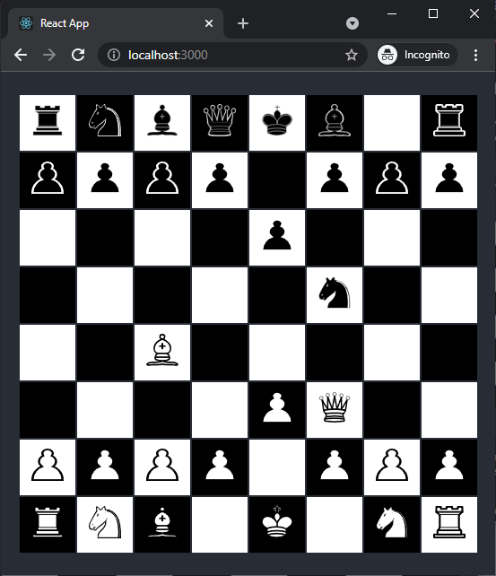

Chess ReactJS
=============

A simple chess set for two human players implemented in ReactJS as a learning exercise.

The pieces can be moved around the board by clicking a square containing a piece
and then clicking on any other square.

As of this writing, many of the rules of chess are implemented, but not all.
Only pieces belonging to the player whose turn it is may move.  All the pieces except
the pawn have restrictions on how they may move and/or capture in place.
Castling, capturing en passant, and pawn promotion are not yet supported.

Origin
------

The application was intially created using the "create-react-app" command,
by running the following commands within the "Source" directory
of this repository (assuming that npm was installed beforehand):

	npm install -g create-react-app
	create-react-app react-app

Then the automatically generated .git directory was deleted to make it possible
to create a different Git repository in a containing directory.x

Running
-------

The repository does not include all the many NPM packages it needs to run,
because including them makes the repository quite unwieldy, adding over 70 mebibytes.
The missing packages can be added by running the command "npm update" from within the react-app directory.
Then the program can be run by running the command "npm start" from within the react-app directory,
and, if it is not done automatically, by navigating to http://localhost:3000 in a web browser.

